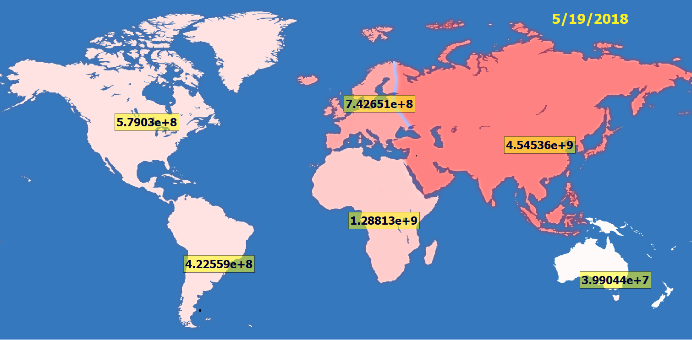
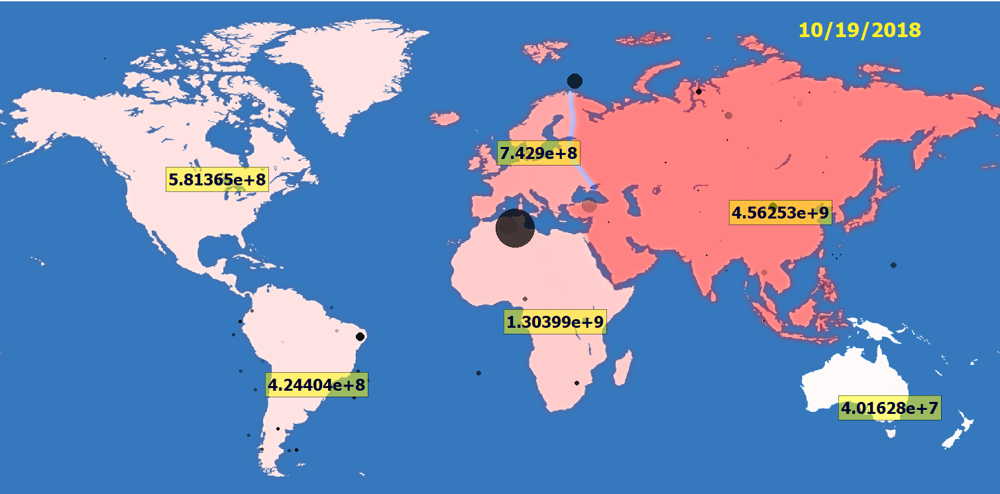
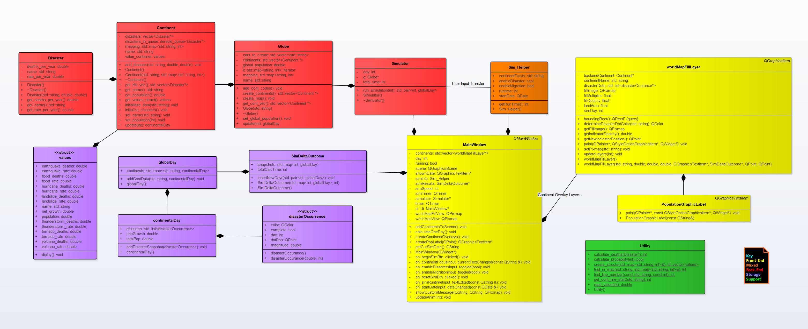

# World Population Simulator
This simulation software focuses on continental population impact of disasters, migration and other attributes.
The simulation utilizes a QTimer to allow users to control and observe the simulaion as it occurs. Other Qt 
classes such as QGraphicsItem and QGraphicsText are also inherited from and cutomized to fit the need of the 
simulation.

# Current Results
Redness of Continents: Population Density | Black Dots: Disaster Magnitude (size), Date Occured (Opacity)
### Initial

### After 5 Months

# Current Design
See repository files for enlarged version and progress

